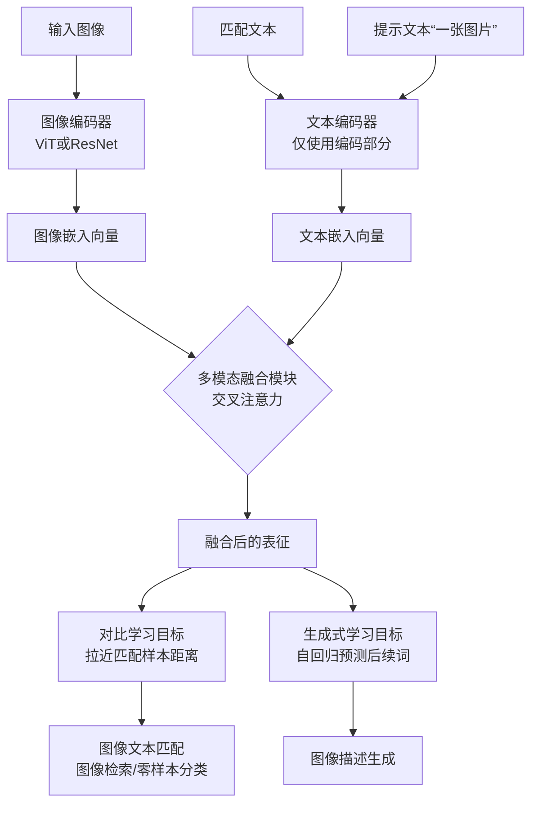

好的，我们来详细解释一下什么是 CoCa。

### 一、核心定义

CoCa 的全称是 **Contrastive Captioners**（**对比字幕生成器**）。它是由 Google Research 在 2022 年提出的一种先进的**多模态**人工智能模型。

简单来说，CoCa 是一个能够**同时理解图像和文本**的模型，并且具备两种核心能力：
1.  **图像描述生成**：看一张图，能生成一段描述它的文字（字幕）。
2.  **图像-文本匹配**：判断一段文字和一张图片在内容上是否相关。

它的核心创新在于**统一**了两种训练多模态模型的主流方法：**对比学习**和**生成式学习**。

---

### 二、名字背后的含义：为什么叫“对比字幕生成器”？

这个名字完美地概括了它的设计精髓：

1.  **字幕生成器**：这指的是模型的**生成能力**。就像视频的字幕（Caption）可以描述视频内容一样，CoCa 能够为图像“生成字幕”，即用自然语言描述图像内容。这源于**图像字幕生成**任务。

2.  **对比**：这指的是模型的**理解/判别能力**。它使用了**对比学习**的方法，让模型学会将匹配的“图像-文本对”拉近，将不匹配的推远。这源于**对比语言-图像预训练**方法。

CoCa 的巧妙之处在于，它将这两个原本独立的任务和目标函数**融合到了一个统一的模型架构和单次训练过程中**。

---

### 三、技术核心：它是如何工作的？

CoCa 的模型架构和训练流程是其成功的关键，下图直观地展示了其工作流程：

#### 1. 模型架构 (一个编码器，两个解码器)

CoCa 基于经典的 Transformer 编码器-解码器结构，但做了关键改进：

*   **图像编码器**： 使用一个 **ViT** 或 **ResNet** 等视觉主干网络来提取图像的视觉特征。它将一张图片转换成一串视觉特征向量。
*   **文本编码器**： 一个 **仅包含编码器部分** 的文本模型（类似于 BERT）。它处理输入的文本，为对比学习生成文本特征。
*   **文本解码器**： 一个 **仅包含解码器部分** 的文本模型（类似于 GPT）。它接收图像编码器输出的视觉特征，通过**交叉注意力机制**融合视觉信息，然后自回归地（一个字一个字地）生成图像描述。

**最关键的一步**：图像特征会同时送给**文本编码器**和**文本解码器**，但用途不同。

#### 2. 训练目标 (融合两个损失函数)

CoCa 在一次前向传播中同时计算两个损失，并加权求和：

1.  **对比损失**：
    *   **目的**： 让模型学会判断图像和文本是否匹配。
    *   **做法**： 将**图像编码器**的输出和**文本编码器**的输出进行匹配计算。模型会学习让匹配的“图像-文本对”在向量空间中的距离更近，不匹配的对距离更远。
    *   **源自**： CLIP 模型的思想。

2.  **生成损失**：
    *   **目的**： 让模型学会根据图像生成描述文本。
    *   **做法**： 将**图像编码器**的输出输入到**文本解码器**中，让解码器预测下一个词（类似于训练一个视觉版的 GPT）。损失函数就是计算预测文本和真实描述文本之间的差异。
    *   **源自**： 图像字幕模型的思想。

通过同时优化这两个目标，CoCa 既学会了**深度理解**（对比学习），又学会了**自由生成**（生成学习），从而成为一个能力全面的多模态模型。

---

### 四、为什么 CoCa 很重要？它的优势是什么？

1.  **强大的性能**： CoCa 在众多视觉和多模态基准测试中都取得了**最先进（State-of-the-Art）** 的性能，例如 ImageNet 图像分类、COCO 图像描述生成和图像文本检索等任务。

2.  **“ALL-in-ONE”的通用性**： 由于同时具备理解和生成能力，一个预训练好的 CoCa 模型可以**无需微调（即零样本）** 或**稍作微调**就能直接用于多种下游任务，包括：
    *   **图像分类**
    *   **图像描述生成**
    *   **视觉问答**
    *   **图像-文本检索**
    *   **多模态理解**

3.  **高效的训练**： 虽然模型能力强大，但它的训练过程是**单阶段**的。相比于先训练一个对比模型（如 CLIP），再训练一个生成模型（如字幕模型）的两阶段方法，CoCa 的效率更高。

### 总结

CoCa 是一个**统一了对比学习和生成学习的多模态基础模型**。它通过一个巧妙的“编码器+双解码器”架构和融合损失函数，同时掌握了**理解**和**生成**两大能力，使其成为一个功能强大且通用的视觉-语言基础模型，为后续的模型（如 Florence、GPaT 等）设计提供了重要的思路。